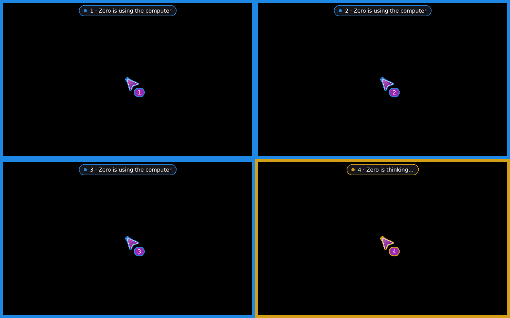

# Zero Use Computer

**Desktop control for AI agents.** Your agent reads the app the way a
screen reader does, acts on real controls, and looks at pixels only when
they matter. One Rust binary, any MCP client, Windows, macOS and Linux.

[Download v3.9.4](https://github.com/mhrsdev/zero-use-computer/releases/latest)
· [Connect a client](docs/CONNECT.md)
· [Guide](docs/GUIDE.md)
· [Benchmarks](bench/README.md)
· [Changelog](CHANGELOG.md)

---

Most computer-use agents send a screenshot every turn and guess where to
click. Zero gives the model the window's accessibility tree with numbered
elements, so `click(12)` presses the Save button through the OS's own
accessibility API. Most actions work on windows in the background without
touching the user's mouse, and the whole loop costs a fraction of the
tokens.

```text
> get_app_state(app="Settings")
App: Settings · window "Settings" · screen #1 (new)
Screenshot #1: 720x360 px.
 26 button "Save"
 27 checkbox "Subscribe to newsletter" (unchecked)
 5 × radio button:
 28 "Canada" (checked) · 29 "Germany" (unchecked) · 31 "Japan" (unchecked) …
 34 text field "Email"
 36 text field "Full name"

> batch(["set 36 \"Ada Lovelace\"", "set 34 \"ada@example.com\"",
         "click \"Japan\"", "click \"Subscribe to newsletter\"", "click \"Save\""])
Ran 5 step(s):
1. set_value — Set text field "Full name"; it shows the new value.
…
State after the steps:
~ 27 checkbox "Subscribe to newsletter" (checked)
~ 31 radio button "Japan" (checked)
~ 36 text field "Full name" value="Ada Lovelace"
```

(Trimmed from a real run of the benchmark's form task: two calls.)

## What makes it different

- **It remembers screens.** Go back a page or close a dialog and the model
  gets "screen #1 (seen before)": the indices it already knows and only
  what changed. A picture the model already has is never sent twice.
- **Each action reports its own result.** The state after a click comes
  with the click, and `expect` says whether the dialog opened or the value
  stuck (confirmed, not seen, or uncertain). No look-again-to-be-sure turns.
- **A small tool list that can reach everything.** The model starts with
  the 15 tools most tasks use. Drawing, design, 3D, exact aiming, windows,
  scripts and the clipboard are one `find_tools` away, and the list never
  changes, so the prompt cache holds.
- **It reads what the tree can't.** Canvases and painted text are read off
  the screen and become clickable `ocr text` elements.
- **Pictures by need.** A screenshot comes when it shows something the
  text doesn't: a picture whose only news is a number or a line the tree
  already reports is left out, and one always follows an action at x/y or
  an `expect` that wasn't met. The model can set it per app (`pictures`:
  always, never, auto), and `doctor` lists the apps whose tree said least
  (v3.9.4).
- **A decision model, if you want one.** Add a fast model (TypeSafe's
  Jev, or any OpenAI-compatible one) and the agent hands it the small
  judgments: which of 50 reviews are positive, has the page loaded,
  which element is "the add-to-cart button". The server also asks it
  on its own where that saves a turn, answers the same question once,
  and never waits on it. Without one, everything works as before.
- **Several agents at once.** Subagents, or Claude Code beside Codex:
  each gets a numbered cursor, its own part of the screen and turns at
  the keyboard and mouse, and one stop key stops them all. They can send
  each other short notes, if you let them.
  [How](docs/GUIDE.md#several-agents-on-one-desktop-v39).

  
- **You stay in control.** An on-screen indicator, an emergency stop key
  (Ctrl+Alt+Esc), a pause while you use the mouse, masked passwords and
  card numbers, and keystrokes that only ever go to the app they're meant
  for. Which apps the agent may touch is set by a
  [security skill](skills/computer-use-security/SKILL.md).

## Numbers

Six real tasks in a GTK app (a form, a 300-row table, a canvas, a dialog
flow, a longer session), success checked from the app's own record. Every
release run as it ships, over MCP, with its own skills; scripted runs,
three each, every task in a run of its own. Tokens are estimates (4
characters a token, an image width × height / 750, no prompt cache).
[Full tables](bench/results/v3.9-releases/step.md) ·
[every version](#version-history-and-token-use).

| | v3.0 | v3.6 | **v3.9** |
|---|---|---|---|
| Sent with every request (instructions, skills, tools) | 6,718 | 7,783 | **4,972** |
| Tool definitions | 4,363 | 4,990 | **2,165** |
| Input to finish all six tasks | 423,650 | 438,848 | **294,840** |

v3.9 sends **36% less per request and 33% less per task** than v3.6
(all of it from v3.7; v3.8 and v3.9 added features at almost no cost: +34
tokens per request). With
`batch`, all six tasks: 323,982 → 216,991 (−33%).

### Apps with nothing for accessibility (v3.9.4)

A seventh task, `counter`: an app that is all painted (a count and three
painted buttons), pressing PLUS three times and looking after each press.
Scripted, two runs each, the same figures:

| | v3.9.3 | **v3.9.4** |
|---|---|---|
| Screenshots sent | 4 whole | **1** |
| Tool results (tokens) | 1,788 | **870** (−51%) |
| Input for the task | 53,928 | **50,640** (−6%) |

The six tasks above: the same results, ≈35 more tokens a request (+0.5%)
for `get_app_state`'s new `pictures` option. Whether a real model does as
well with fewer pictures hasn't been measured.

### Against Codex-style computer use

Codex's computer use is the model this project started from: the same ten
core tools, accessibility first. The benchmark can run Zero the way Codex
behaves (a screenshot with every look, no screen memory, no change report
after an action, every tool listed) and compare. This is a **simulation of
Codex's behaviour on this server, not a run of Codex or of a GPT model**:
the token figures are the benchmark's estimates (no prompt cache), and a
GPT model counts pictures its own way. Measured on v3.9, every task in a
run of its own, three runs each.
[Full table](bench/results/v3.9-codex/compare.md).

| Five tasks (form, table, board, shapes, long) | Codex-style (simulated) | Zero v3.9 | Zero v3.9 + `batch` |
|---|---|---|---|
| Input tokens | 371,576 | **246,537** (−34%) | **184,910** (−50%) |
| Screenshots sent | 11 | **5** | **5** |
| Image tokens | 7,702 | **3,330** (−57%) | **3,330** |
| Tool calls | 41 | 36 | **26** |

Where the difference comes from: fewer pictures (5 instead of 11), a
shorter tool list on every request (2,165 tokens of definitions instead of
3,827) and so a shorter conversation to read again. Not everywhere: the
Codex-style results carry *less* text (2,699 tokens against 4,221; it
sends pictures instead), and on the shapes task, a canvas without text,
the two come out almost even (27,303 against 26,586).

**Read the gap with care.** The simulation lists all of this server's
tools (25) on every request, while Codex's own computer use has about ten,
so its real list is likely shorter. Given a list as short as Zero's, the
Codex-style run would take about 295,000 tokens: Zero would be **about 16%
less** one action a call, and 37% less with `batch`, instead of 34% and
50%. The 16% (pictures, screen memory, change reports) is the part this
benchmark can stand behind.

| | Codex-style | Zero |
|---|---|---|
| Each look | tree and a screenshot | the tree or what changed; a picture only when it adds something |
| Coming back to a screen | everything again | "seen before", only the changes |
| After an action | look again | the change comes with the action |
| Checking an action worked | look and compare | `expect`: confirmed, not seen, uncertain |
| Several known steps | one call each | one `batch`, which stops on an unexpected window |
| Text only in pixels | in the screenshot | read off the screen, clickable |
| Tool list | every tool, every request | 15 tools plus `find_tools`; the rest on demand |
| Clients | | any MCP client: Claude Code, Codex, Cursor, VS Code, Claude Desktop |
| Extras | | 2D design board, 3D scene planner, exact aiming, scripts, a fast decision model |

## Quick start

1. Download the zip for your system from the
   [latest release](https://github.com/mhrsdev/zero-use-computer/releases/latest)
   and extract it somewhere permanent.
2. **Claude Code:** run `./install.sh` (macOS, Linux) or `install.cmd`
   (Windows). It registers the server; `claude mcp list` shows it.
   **Anything else:** point your client at `computer-use-mcp serve`.
   Configs for Codex, Cursor, VS Code and Claude Desktop are in
   [`examples/`](examples) and [docs/CONNECT.md](docs/CONNECT.md).
3. Give the agent the [skills](skills/) (the zip is also a Claude plugin
   that brings them).

`computer-use-mcp doctor` checks permissions and the stop key. On macOS,
allow Accessibility and Screen Recording for the app that starts the
server. On Linux it needs the AT-SPI bus (X11, or Wayland with Hyprland,
sway and other wlroots compositors).

Build it yourself:

```bash
cargo build --release -p computer-use-mcp
```

Or embed the library (`computer-use`) in your own agent:
[Guide › Embed the library](docs/GUIDE.md#embed-the-library).

## Docs

- [Guide](docs/GUIDE.md): every tool, setting, platform detail and
  architecture note.
- [Connect a client](docs/CONNECT.md) · [Upgrading](docs/MIGRATING.md) ·
  [Roadmap](docs/ROADMAP.md)
- [Benchmarks](bench/README.md): how tasks are measured, and how to run
  them against any release.
- Skills: [computer-use](skills/computer-use/SKILL.md),
  [security](skills/computer-use-security/SKILL.md),
  [design](skills/computer-use-design/SKILL.md).

## Version history and token use

<details>
<summary>Every minor version from the first release to v3.9 (and v3.9.1–v3.9.4): what changed, and what it cost in tokens (measured)</summary>

### How this was measured

Each version's own Linux release, run as it ships over MCP with its own
skills and instructions, through the [benchmark](bench/README.md)'s six
tasks: scripted calls (the same way through each task), three runs each,
every task in a run of its own, medians. Tables and every run:
[bench/results/v3.9-releases](bench/results/v3.9-releases/step.md).
Read the numbers with these limits:

- **Estimates, not a model's bill.** Text is counted as 4 characters a
  token, a picture as width × height / 750, and "input" sends the whole
  prefix again on every call with **no prompt cache**. Real clients cache
  the prefix (it then costs about a tenth), so the real gap between
  versions is smaller than these figures. No version has been measured
  with a real model yet.
- **One app, one system:** a GTK app under Xvfb on Linux. Windows and
  macOS were not measured.
- **Each line is the newest patch of its minor version** (v2.5 is v2.5.7,
  v3.7 is v3.7.5, v3.8 is v3.8.3). There was never a v1.x: the first
  release was v0.1, and the next was v2.0. v3.5 was never released on its
  own; it shipped inside v3.6.
- **v0.1 and v2.0 can't do the two canvas tasks** (no `locate`), so the
  versions are compared on the four tasks all of them finish, and on all
  six from v2.5 on.
- **Earlier reports were slightly off.** They ran every task of a version
  one after another in one desktop, and some tasks come out differently
  that way (an extra look, an extra picture) than run alone, so every
  number here was measured with each task alone. The earlier report gave
  v3.7.0 250,701 over the four tasks and 24,769 on the canvas task;
  v3.7.5 alone takes 249,895 and 16,995.
- **Run to run:** v3.7 to v3.9 give the same figures every run (within
  0.1%); v2.5 to v3.6 vary by up to 5% on the canvas tasks (how much OCR
  reads). The tables give the medians.

### Token use, version by version

| version | sent with every request | of it, tool definitions (tools listed) | four tasks (form, table, orders, long) | all six tasks | all six with `batch` |
|---|---:|---:|---:|---:|---:|
| v0.1 | 4,236 | 1,929 (23) | 254,975 | can't (canvas) | |
| v2.0 | 3,938 | 1,950 (23) | 245,135 | can't (canvas) | |
| v2.5 | 6,637 | 4,511 (23) | 351,112 | 422,773 | |
| v2.6 | 7,164 | 4,809 (24) | 371,665 | 449,400 | |
| v3.0 | 6,718 | 4,363 (24) | 349,868 | 423,650 | |
| v3.1 | 6,718 | 4,363 (24) | 349,868 | 423,650 | |
| v3.2 | 7,415 | 4,607 (25) | 376,841 | 455,557 | |
| v3.6 (with v3.5) | 7,783 | 4,990 (25) | 367,006 | 438,848 | 323,982 |
| v3.7 | 4,938 | 2,167 (17) | 249,895 | 296,221 | 217,854 |
| v3.8 | 4,938 | 2,167 (17) | 249,895 | 296,221 | 217,854 |
| **v3.9** | **4,972** | **2,165 (17)** | **248,656** | **294,840** | **216,991** |

### The major versions

- **v0.1 → v2.0:** −7% per request (4,236 → 3,938), −4% over the four
  tasks. Access control moved out of the server into a security skill;
  trees got a token budget; overview screenshots; layered skills.
- **v2.0 → v3.0:** +71% per request (3,938 → 6,718), +43% over the four
  tasks. Paid for by new abilities: drawing, the design board, the 3D
  scene, tracing pictures, exact aiming and scripts (and, from v2.5, the
  canvas tasks v2.0 couldn't do at all). v3.0 itself was a stability
  release that took back 6% of v2.6's cost.
- **v3.0 → v3.9:** −26% per request (6,718 → 4,972), −29% over the four
  tasks, −30% over all six (423,650 → 294,840); tool results −39%,
  pictures 10 → 6, calls 42 → 40. Almost all of it came in one step, v3.7.
- **v4.0:** not released. The [roadmap](docs/ROADMAP.md#left-before-v40)
  keeps it for defaults chosen from real-model runs, tests on real
  Windows and macOS hardware, and the full benchmark with real numbers.

From the first release to v3.9: 17% more per request (4,236 → 4,972),
2.5% less over the four tasks both can do (254,975 → 248,656), with the
text of tool results 43% smaller (pictures the same), the canvas tasks
possible, and far more tools behind `find_tools`.

### Each minor version

- **v0.1** (v0.1.0–v0.1.5): the first release. Linux, macOS and Windows
  backends; accessibility tree with numbered elements; `click`,
  `set_value`, `type_text`, `press_key`, `scroll`, `drag`, `find_element`,
  `wait_for`, `batch`, screenshots, clipboard; screen memory; the
  on-screen indicator, stop key, pause while the user works and
  redaction; OCR; window management; on-screen approvals; HTTP transport;
  Claude plugin zips.
- **v2.0:** fewer tokens (a tree budget, overview screenshots, notes said
  once, layered skills, adjustable summarizing); access control as a
  security skill; steadier keyboard, screenshots and text.
  Per request −7%, four tasks −4%.
- **v2.5** (v2.5.0–v2.5.7): `draw` (shapes, curves, plots, fills),
  `trace_image`, the `design` board, the 3D `scene`, graph-paper cells,
  `locate` for exact aiming. Per request +69%, four tasks +43%: the first
  version that does the canvas tasks.
- **v2.6:** `script` (Rhai): programs that run tools with logic around
  them; saved scripts become tools. Per request +8%, four tasks +6%.
- **v3.0:** stability: no call can hang the server, a busy app is told
  apart from a failed one, an action sent but not answered is never done
  twice, clients can cancel. Per request −6%, four tasks −6%.
- **v3.1:** Wayland in full (Hyprland, sway and other wlroots
  compositors); no overlay flicker under compositors. Tokens unchanged.
- **v3.2:** the optional decision model (`decide`, `wait_for(until=…)`);
  apps without accessibility on Linux. Per request +10%, four tasks +8%.
- **v3.5** (inside v3.6): the benchmark itself; screenshot numbers; blind
  areas read by OCR.
- **v3.6:** trees and reports that say each thing once (`tree.compact`),
  OCR that suits the content, `expect` on actions, batch lines with
  clicks by name, design answers that say what changed. Per request +5%;
  over the tasks −3% (−20% of tool results); with `batch`, −29% of the
  calls.
- **v3.7** (v3.7.0–v3.7.5): the tool manager on by default (17 tools
  listed, the rest found with `find_tools`), shorter instructions and
  skills, results said once, every token-saving setting on; v3.7.5 fixed
  32 bugs. **Per request −37%, over the tasks −32%**: the biggest saving
  so far.
- **v3.8** (v3.8.0–v3.8.3): the decision model built in and never
  depended on; the design board two thirds cheaper (its own
  [benchmark](bench/results/v3.8.1-design/compare.md)); stable on unusual
  setups on every system; 15% faster on the server. These six tasks don't
  use the design board, so their tokens are unchanged.
- **v3.9** (with v3.8.5): several agents on one desktop (numbered
  cursors, parts of the screen, turns, one stop key, messages); one MCP
  core for stdio and HTTP, batches, progress, Streamable HTTP,
  annotations. Per request +0.7% (+34 tokens, a line in the skill about
  other agents), over the tasks −0.5%.
- **v3.9.1–v3.9.4**, fixes and one feature:
  - v3.9.1: the Windows overlay stays above the taskbar.
  - v3.9.2: a debugging release: security (keys out of scripts' reach),
    crashes, wrong results, Persian typing on X11.
  - v3.9.3: the six bugs v3.9.2 left (a minimized Store app's window,
    X11 window moves checked, a closed Wayland layer, per-monitor scale,
    one-character OCR words, first-time explanations).
  - v3.9.4: screenshots by need, the model's `pictures` setting, a record
    of which apps needed pixels; a painted app no longer gets a whole
    picture per change. The six tasks: tool results unchanged, +0.5% per
    request; the painted-app task: 4 pictures → 1, −51% of tool results.
  Windows and Wayland fixes in these were checked by CI, not on real
  desktops.

### v3.9 against v3.6 (with v3.5) and v3.0

| all six tasks | v3.0 | v3.6 | v3.9 | v3.9 against v3.6 | against v3.0 |
|---|---:|---:|---:|---:|---:|
| sent with every request | 6,718 | 7,783 | 4,972 | −36% | −26% |
| input, one action a call | 423,650 | 438,848 | 294,840 | −33% | −30% |
| input, with `batch` | | 323,982 | 216,991 | −33% | |
| tool results | 13,269 | 10,266 | 8,068 | −21% | −39% |
| pictures sent | 10 | 9 | 6 | −3 | −4 |
| tool calls | 42 | 41 | 40 | −1 | −2 |
| seconds on the server, four tasks | 11.2 | 11.9 | 14.0 | +18% | +25% |

What did it, and what didn't:

- **v3.7 did it.** v3.8 and v3.9 cost the same per task as v3.7: they
  added the decision model, the faster design board and several agents
  without adding to it.
- **v3.9's tool results are 5% smaller than v3.8's** in this benchmark,
  but only because v3.8's first look under the test desktop carried two
  notes (that the stop key didn't work, and that part of the window had
  no accessibility information) and v3.9's didn't. Whether v3.8's notes
  were false alarms there was not settled, so this is not counted as a
  v3.9 gain.
- **Slower on the server**: the four tasks take 14.0 s of tool time
  against v3.0's 11.2 s, mostly OCR of areas without accessibility
  information (on by default since v3.7). A model's own time is far
  longer than either.

</details>

## License

Apache-2.0. See [LICENSE](LICENSE) and [NOTICE](NOTICE).
