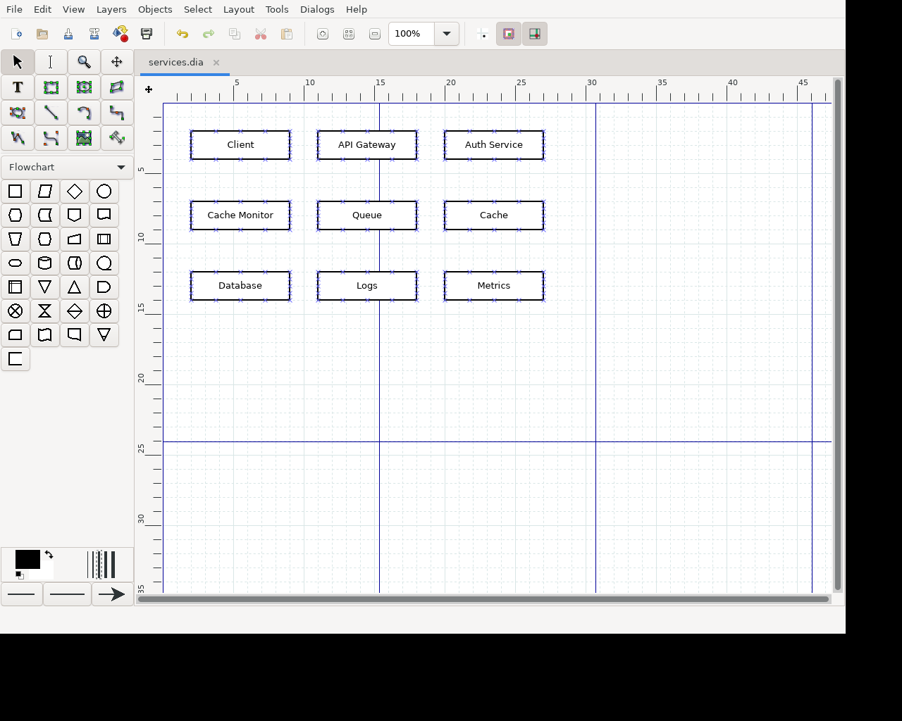

# Canvas benchmark: an app whose content is invisible to accessibility

Linux · Dia 0.98 · one real model · 10 runs per arm · 2026-10-02 · server at
`b6962a0` (v3.1.0), unmodified.

## Short answer

On a real canvas app, with a real model doing a real task, **zero-use-computer
saved nothing**. Both approaches succeeded 10/10. The current path used
**1.2% more** input tokens per run (median, measured exactly), because the one
feature that fired, the change report after each action, adds text, and the
features that save tokens never got a chance:

| per run | screenshot-every-call baseline | zero-use-computer (defaults) |
|---|---|---|
| task success (checked in the saved file) | **10/10** | **10/10** |
| wrong box deleted / false "DONE" | 0 / 0 | 0 / 0 |
| model input tokens, **exact**: median (mean) | 38,960 (38,976) | 39,444 (41,189) |
| model output tokens, exact: mean | 413 | 418 |
| images sent to the model: mean | 2.0 | 2.1 |
| tool calls / model requests: mean | 5.1 / 3.0 | 5.1 / 3.1 |
| task time, wall clock: mean | 10.5 s | 10.7 s |
| OCR used (auto or asked) | 0 runs | 0 runs |
| unchanged screenshot not re-sent, or only the changed part sent | n/a | 0 runs |

The 46k → 6.8k figure in the main README is real, but it measures something
else: a scripted session with no model, on an app whose tree describes
everything, counting estimated tool-result tokens only (section 1).

## 1. What the earlier 46k → 6.8k figure measured

From `crates/computer-use/examples/compare.rs` and the README:

- **The baseline was a simulation, not Codex.** It was this same server,
  configured the way Codex's computer use behaves: a screenshot with every
  `get_app_state`, no screen memory, no picture dedupe, whole-window
  pictures, and no change report.
- **There was no model.** A fixed script made 61 calls on
  `gtk3-widget-factory`: 21 `get_app_state`, 20 `find_element` and
  20 `click`, going between "Page 2" and "Page 1" ten times.
- **The tokens were estimated, not measured.** Text counted as characters / 4
  and each image as width × height / 750, summed over tool results, each
  counted once. It left out the system prompt, the tool definitions, the
  model's output, and the conversation history a model re-reads on every
  request.

Rerun on this machine with the same command, it reproduces exactly:
`Codex-style 46,280` vs `computer-use defaults 6,821` estimated tokens (6.8×),
with 21 vs 2 images. It is accurate for what it measures. That case suits the
server: a tree-rich app, revisiting the same two screens many times.

## 2. Setup

**App.** Dia 0.98 (GTK3, Ubuntu 24.04 package `0.98+git20240130-1build4`)
runs on Xvfb at 1280×1024 with no window manager. The window is resized to
1200×900 at (0, 0) in every run.

**The canvas is invisible to accessibility.** This was checked before the
runs and again at the start of every run with `atspi_dump.py`, which walks the
raw AT-SPI tree independently of the server's code:

- Dia exposes 433 accessible nodes (menus, toolbars, toolbox).
- Its drawing area has **0 children** and only the `Accessible`,
  `Collection` and `Component` interfaces (no `Text`).
- **None of the nine box labels** appears in any accessible name,
  description or text. The only match is an unrelated "Database" menu item
  in Dia's shape-sheet list.
- The server's own tree shows `drawing area (focused)` with nothing in it.

**Starting diagram** (`make_diagram.py`): nine labelled Flowchart boxes in a
3×3 grid. "Cache Monitor" sits next to "Cache" as a near-miss target.



**Task.** These are the exact prompts the model sees in both arms, from
`prompts.sh`:

> System: You control a Linux desktop through the computer-use tools
> (mcp__cu__*). They are your only tools. Work carefully and efficiently. When
> the task is complete, reply with the single word DONE. If you cannot complete
> it, reply with FAILED: followed by the reason.
>
> User: The diagram editor Dia is open with the file services.dia. Delete the
> box labelled exactly "Cache" (not "Cache Monitor", not any other box) and
> leave everything else in the diagram unchanged. Then save the file in place
> with Ctrl+S.

**Success criterion** (`verify.py`, run on the file on disk after the run):

- the file was saved during the run;
- "Cache" is gone;
- the other eight boxes are all present, with the same labels and positions
  (within 0.01 cm);
- nothing else is in the file.

`verify_selftest.py` checks the verifier against wrong outcomes: nothing
changed, "Cache Monitor" deleted instead, both deleted, a box moved, a label
edited. Only the correct edit passes.

**Feasibility.** An oracle run with no model (`run_one.sh oracle`) clicks the
centre of the Cache box through the server, presses Delete, then Ctrl+S. It
passes the verifier.

**Arms.** The model, prompts, tools, limits, window and starting state are the
same in both arms. Only the server's config file differs:

| | `configs/baseline.toml` | `configs/current.toml` |
|---|---|---|
| what it is | simulation of screenshot-every-call (Codex-style, as in `compare.rs`) | v3.1.0 defaults |
| screenshot with `get_app_state` | always, whole window | when needed (first view, changes, sparse tree) |
| screen memory, picture dedupe, changed-part screenshots | off | on |
| change report after actions | off | on |
| OCR | off, and unavailable even if asked | auto (window with < 3 interactive elements) or when asked |

Both arms also turn the audit log on, for measurement only.

**Model and harness.** Claude Code CLI 2.1.287 in print mode (`claude -p`):

- model `claude-sonnet-5-5`, effort `medium`;
- at most 40 turns and 900 s per run;
- only the server's tools: the CLI's built-in tools are off, with no
  settings, CLAUDE.md, skills or session persistence;
- neither arm gets this repository's computer-use skill (`SKILL.md`), only
  the tools' own descriptions.

**Each run starts clean** (`run_one.sh`): a new X server, D-Bus and AT-SPI
bus, a fresh Dia profile and diagram, a new server process (empty screen
memory, fresh `COMPUTER_USE_HOME`), and a new CLI session. The starting
screenshot is byte-identical in all 20 runs. The arms alternate in ABBA order
(`run_all.sh`), 10 runs each. One pilot run per arm was made to test the
harness and is not counted.

The API's prompt cache is shared across runs, because every run starts with
the same prefix. That changes how input splits between cache reads and cache
writes, and so the dollar cost, but not the token counts reported here.

## 3. What is measured, and how

**Exact (from the API):**
- Model input tokens: input + cache read + cache write, summed over the run.
- Model output tokens.
- Input per model request.

These come from the per-model usage the CLI reports from the API's responses
(`modelUsage` in its final `result` event). Per-request input comes from each
response's usage. In every run the per-request sums equal the totals. The
CLI also makes a small side call to Haiku (947 in, 15 out, the same in every
run); it is listed in `runs.json` and left out of the tables.

**Estimated (the earlier benchmark's formula):**
- Tool-result tokens: characters / 4 for text, width × height / 750 for each
  image. Reported only so the two methods can be compared.

**Counted:**
- Images in tool results.
- Tool calls.
- Physical button presses. `click_logger.py` reads XI2 raw events; it agreed
  with the tool's clicks in every run (11 and 10 presses).
- Click positions. These come from the server's own result text, "Clicked the
  point at (x, y)". With the window at (0, 0) and screenshots unscaled, those
  are screen pixels. Each one is classified against the box rectangles in
  `boxes.json`, found from a colour-coded copy of the diagram
  (`run_one.sh calibrate`).

**Timed:**
- Wall clock from agent start to exit, plus the CLI's model API time.

**Features:**
- Which savings features fired, read from each tool result's text.

## 4. Results

The full tables are in
[`results/2026-10-02/summary.md`](results/2026-10-02/summary.md); every run is
in `runs.json`. The transcripts are under `raw/*/stream.jsonl`, with images
replaced by their size and hash and the CLI's account and rate-limit events
left out.

**What the model did.** Both arms took the same path in 18 of 20 runs:

1. `get_app_state(screenshot=true)`;
2. a pixel `click` on the Cache box, read off the screenshot;
3. `press_key Delete`, then `press_key ctrl+s`;
4. one `screenshot` to check the result;
5. `DONE`.

That is 3 model requests. The two exceptions:
- one baseline run first clicked empty canvas to clear what looked like a
  selection (every box shows connection-point markers that look like
  selection handles);
- one current run took two extra screenshots.

**Targeting.** Every run clicked inside the Cache box (x 660–745,
y 315–318; the box spans 629–772 × 284–327). No run clicked another box,
deleted the wrong box, or claimed DONE without success.

**Where the tokens go** (median per request, exact):

| request | baseline | current |
|---|---|---|
| 1: system prompt + 24 tool definitions + task | 9,954 | 9,953 |
| 2: + `get_app_state` result (tree text + a 1200×900 screenshot) | 13,511 | 13,510 |
| 3: + action results + check screenshot | 15,500 | 15,971 |

- **Fixed overhead dominates.** The system prompt, tool definitions and task
  are re-sent with every request: 77% of a 3-request run's input. No
  tool-result saving can touch that.
- **The change reports are the whole difference.** They are the "State after
  the action" text after the click, Delete and Ctrl+S, and cost **+471
  tokens, exact**. The characters / 4 estimate puts them at +265, an
  undercount of about 1.8× for this kind of text.
- **They were useful, but not used.** The reports already confirmed the
  outcome: Dia's status bar said "Selected 'Cache'", and the title gained and
  then lost its unsaved `*`. The model still checked with a screenshot.

## 5. Why the savings features did not fire

| feature | fired | why not |
|---|---|---|
| OCR, automatic | 0 / 10 runs | It needs fewer than 3 interactive elements in the **whole window**. Dia's chrome has 70 (45 tool radio buttons, 18 buttons, 3 toggles, 2 combo boxes, a text field, a tab), so a canvas app with ordinary chrome never qualifies. |
| OCR, asked (`ocr=true`) | never asked | Tried separately: it returned 15 lines, all ruler numbers or icon noise ("iy", "oo", "Co"), and **none of the nine labels**. Tesseract reads "Cache" from a crop of the text alone, but nothing once the box's border is in the picture (page modes 6, 7, 11 and 12 all return empty). |
| unchanged screenshot not re-sent | 0 | The model looked only once with `get_app_state`, and a first view is always sent. It checked its work with `screenshot(app)`, which always sends the whole window (section 6, item 3). |
| only the changed part sent | 0 | Same reason. |
| screen memory ("seen before") | 0 | No screen was revisited. |
| change report | 30 results in 10 runs | It fired every time. It added tokens and carried the confirmation the model did not use (section 4). |

## 6. Bugs and limitations found (recorded, not fixed)

The server code was not changed. These are open:

1. **Bug: `screenshot` silently ignores a region given without `mode`.** The
   compact tool description says "a region (x,y,width,height)". But when
   `app` is given, `mode` defaults to `window`, so x/y/width/height are
   dropped without a word and the whole window is sent. In run `current-2`
   the model asked for 400×100 at (0, 0) and got 1200×900 (about 1,440
   estimated image tokens instead of about 54). It should either honour the
   region or reject the call.
2. **OCR on Linux can't read text inside bordered shapes,** with Tesseract as
   invoked (upscaled 2×, `--psm 11`). It also passes icon noise through as
   clickable `ocr text` elements: anything with confidence ≥ 0.4 and at
   least 2 letters or digits gets through.
3. **The automatic OCR threshold counts the whole window,** so apps whose
   chrome is accessible but whose canvas is not never get OCR automatically.
4. **`screenshot(app)` never dedupes or sends only the changed part.** Only
   `get_app_state` and full-screen screenshots do. The usual way a model
   double-checks its work bypasses both savings features.

These were harness issues, not product bugs:
- The X pointer can't give click positions, because the server puts the
  pointer back after each click.
- Dia widens Flowchart boxes whose text doesn't fit, which moved them in the
  first oracle run, so the boxes were made 7 cm wide.

## 7. What this does and does not show

- **One app, one short task, one model, Linux only.** macOS and Windows were
  not measured. On macOS, OCR uses Apple's Vision, which may read these labels.
- **The task is short** (3 model requests). The savings features target
  repeated looks at the same screens. A long session on a canvas, with many
  looks, might come out differently. That was not measured here.
- **The baseline simulates screenshot-every-call with this server.** It is
  not Codex. Both arms had the accessibility tree of Dia's chrome.
- Model sampling is not seeded. There were 10 runs per arm.

## 8. Reproduce

```bash
sudo apt-get install -y --no-install-recommends dia at-spi2-core xvfb dbus \
  xdotool imagemagick tesseract-ocr tesseract-ocr-eng python3-gi gir1.2-atspi-2.0
python3 -m pip install python-xlib pillow
cargo build --release -p computer-use-mcp
cd benchmarks/canvas
python3 verify_selftest.py                       # the verifier rejects wrong outcomes
./run_one.sh calibrate /tmp/calib && cp /tmp/calib/boxes.json .   # box rectangles
./run_one.sh oracle /tmp/oracle                  # the task can be done here
./run_all.sh 10 results/$(date +%F)              # 10 runs per arm, then analyze.py
```

`run_one.sh` needs the `claude` CLI, logged in. `analyze.py results/2026-10-02`
recomputes every table from the committed files.

| file | what it does |
|---|---|
| `make_diagram.py` | writes the starting diagram (`--colors`: the calibration copy) |
| `verify.py`, `verify_selftest.py` | the success criterion and its negative controls |
| `atspi_dump.py` | the independent raw AT-SPI check |
| `run_one.sh`, `run_all.sh`, `prompts.sh`, `configs/` | the runs |
| `click_logger.py`, `stamp.py`, `mcp_call.py`, `calibrate.py`, `boxes.json` | the instruments |
| `analyze.py` | metrics and tables |
| `results/2026-10-02/` | this run's data: `summary.md`, `runs.json`, and per run the saved file, verdict, audit log, click log, AT-SPI check and image-free transcript |
